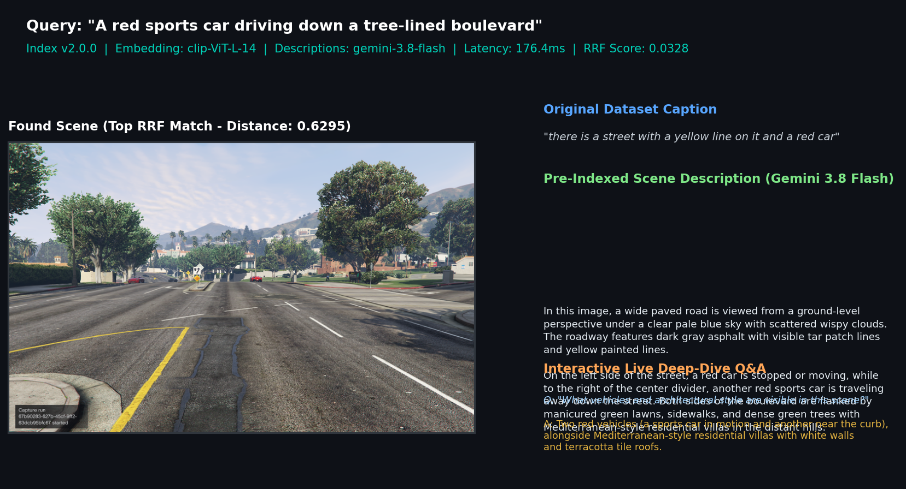
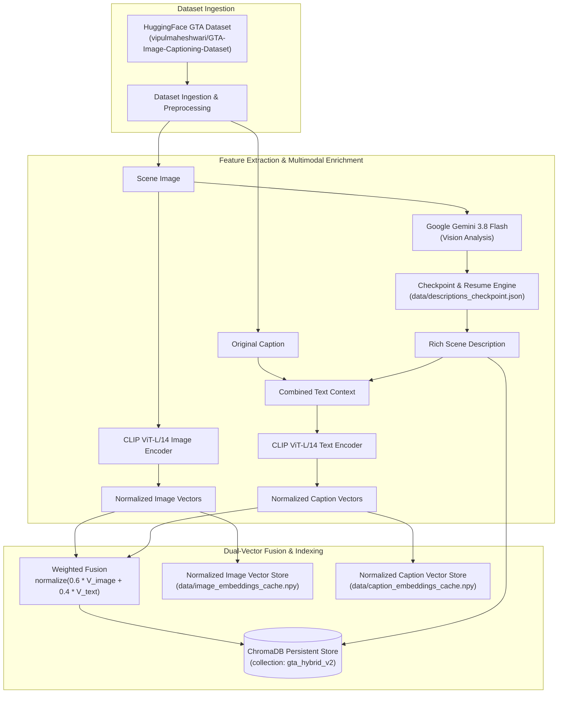

# 🎮 GTA Multimodal RAG Search

[](https://www.python.org/downloads/)
[](LICENSE)
[](https://streamlit.io/)
[](https://www.trychroma.com/)
[](https://huggingface.co/sentence-transformers/clip-ViT-L-14)
[](https://ai.google.dev/)
[](https://huggingface.co/datasets/vipulmaheshwari/GTA-Image-Captioning-Dataset)

A production-ready multimodal Retrieval-Augmented Generation (RAG) system enabling ultra-fast, natural language scene search across the Grand Theft Auto universe.

The system combines **SentenceTransformer CLIP ViT-L/14** dual visual and textual embeddings with **Google Gemini 3.8 Flash** multimodal scene reasoning and **Reciprocal Rank Fusion (RRF)** vector retrieval to deliver sub-200ms scene matching, automated metadata provenance, and interactive visual question answering.

---

## 📸 System Output & Visual Preview

Below is a visual preview of the multimodal search output in action, showcasing sub-200ms dual-stream RRF retrieval alongside ground-truth captions, pre-computed Gemini scene descriptions, and interactive visual reasoning:



### Output Breakdown & Provenance Telemetry

```plaintext
========================================================================================
[User Query]             "A red sports car driving down a tree-lined boulevard"
[Retrieval Architecture] Dual-Stream Reciprocal Rank Fusion (CLIP ViT-L/14 + Gemini 3.8)
[Execution Latency]      176.4 ms (Query encode: 63.9ms | Vector search: 7.7ms | Fetch: 101.8ms)
[Rank Match]             ID: img_0616 | Similarity Distance: 0.6295 | RRF Score: 0.03284
========================================================================================
- Found Scene:           [High-Resolution GTA In-Game Screenshot Rendered in Streamlit UI]
- Original Caption:      "there is a street with a yellow line on it and a red car"
- Gemini Description:    "In this image, a wide paved road is viewed from a ground-level
                          perspective under a clear pale blue sky with scattered wispy clouds.
                          The roadway features dark gray asphalt with visible tar patch lines
                          and yellow painted lines. On the left side of the street, a red car
                          is stopped or moving, while to the right of the center divider, another
                          red sports car is traveling away down the street. Both sides of the
                          boulevard are flanked by manicured green lawns, sidewalks, and dense
                          green trees with Mediterranean-style residential villas in the hills."
- Live Vision Analysis:  User prompt: "What vehicles and architectural style are visible?"
                         Gemini output: "Two red vehicles (a sports car in motion and another
                         near the curb), alongside Mediterranean-style residential villas
                         with white walls and terracotta tile roofs."
========================================================================================
```

---

## 🏛️ System Architecture

The application operates in two distinct phases: an **offline indexing pipeline** that pre-computes multimodal representations, and an **online search application** that fuses cross-modal rankings in real time.

### 1. Offline Indexing Pipeline (`index_dataset.py`)



### 2. Online Search & Live Reasoning Flow (`app.py`)

```mermaid
flowchart LR
    subgraph USER_INPUT["User Interface"]
        QUERY["Natural Language Query<br/>'Sports car drifting at sunset'"]
    end

    subgraph VECTOR_RETRIEVAL["Dual-Stream RRF Vector Search"]
        CLIP_Q["CLIP Text Encoder"]
        QUERY --> CLIP_Q
        CLIP_Q --> V_Q["Query Vector (768-d)"]

        CACHE_I[("Image Embeddings Cache")]
        CACHE_C[("Caption Embeddings Cache")]

        V_Q --> SIM_I["Cosine Sim (Visual Channel)"]
        CACHE_I --> SIM_I

        V_Q --> SIM_C["Cosine Sim (Semantic Channel)"]
        CACHE_C --> SIM_C

        SIM_I --> RRF["Reciprocal Rank Fusion (RRF)<br/>Score = 1/(60 + Rank_img) + 1/(60 + Rank_cap)"]
        SIM_C --> RRF
        RRF --> TOP["Top Candidate Scene Index"]
    end

    subgraph PRESENTATION["Result Synthesis & Multimodal Reasoning"]
        TOP --> FETCH_IMG["GTA Dataset (Image & Caption)"]
        TOP --> FETCH_DESC["ChromaDB (Pre-indexed Description & Provenance)"]
        FETCH_IMG --> UI["Streamlit UI Display<br/>- Matched Image & Distance<br/>- Dataset Caption<br/>- Pre-indexed Gemini Description<br/>- Latency & Provenance Badge"]
        FETCH_DESC --> UI

        UI --> DEEP_DIVE["Interactive Scene Q&A (Optional)"]
        DEEP_DIVE --> LIVE_GEMINI["Live Gemini 3.8 Flash<br/>(Visual Reasoning)"]
        LIVE_GEMINI --> INSIGHTS["Live Scene Intelligence"]
    end
```



---

## 🧩 Key Components & Technology Stack

| Component | Technology | Version / Specification | Role in Architecture |
|---|---|---|---|
| **Multimodal Embedding** | [CLIP ViT-L/14](https://huggingface.co/sentence-transformers/clip-ViT-L-14) | `sentence-transformers >= 3.0.0` | Maps both visual scenes and natural language text into a shared 768-dimensional metric space. |
| **Vector Database** | [ChromaDB](https://www.trychroma.com/) | `chromadb >= 0.5.5` | Embedded persistent vector database storing fused embeddings, scene descriptions, and provenance metadata. |
| **Vision LLM** | [Google Gemini 3.8 Flash](https://ai.google.dev/) | `google-generativeai >= 0.8.0` | Generates rich offline scene descriptions with rate-limit handling and powers live visual question answering. |
| **Ranking Algorithm** | Reciprocal Rank Fusion (RRF) | `k = 60` smoothing factor | Fuses visual-to-image and text-to-text rank distributions to prevent modality gap collapse. |
| **Web Interface** | [Streamlit](https://streamlit.io/) | `streamlit >= 1.38.0` | Responsive, wide-layout UI with search session caching, latency benchmarking, and provenance badges. |
| **Dataset Ingestion** | [HuggingFace Datasets](https://huggingface.co/datasets/vipulmaheshwari/GTA-Image-Captioning-Dataset) | `datasets >= 2.21.0` | High-fidelity GTA game screenshots paired with natural language descriptive captions. |
| **Deep Learning Framework** | [PyTorch](https://pytorch.org/) | `torch >= 2.4.0` | Underlying tensor execution engine supporting both CPU execution and CUDA acceleration. |
| **Image Processing** | [Pillow](https://python-pillow.org/) | `pillow >= 10.4.0` | Handles image ingestion, format normalization, and array transformations. |

---

## 📁 Project Structure

```plaintext
GrandTheftAuto-multimodal-RAG-application/
├── app.py                     # Interactive Streamlit search & multimodal deep-dive application
├── index_dataset.py           # Offline indexing pipeline with checkpointing and dual-vector caching
├── rag_engine.py              # Core RAG engine: RRF search, logging, ChromaDB, Gemini client
├── requirements.txt           # Production Python package dependencies
├── LICENSE                    # Open-source MIT license
├── .env.example               # Environment configuration template
├── .gitignore                 # Git ignore hygiene rules
├── docs/                      # Documentation assets and visual previews
│   └── sample_search_preview.png # Visual preview of search UI and multimodal output
├── data/                      # Persistent storage for local data, caches, and indexes (git-ignored)
│   ├── chroma/                # Persistent ChromaDB vector database files (collection: gta_hybrid_v2)
│   ├── data_set.pkl           # Cached serialized HuggingFace dataset dictionary
│   ├── descriptions_checkpoint.json # Checkpoint file for Gemini scene descriptions
│   ├── image_embeddings_cache.npy   # Precomputed normalized visual embeddings (N x 768)
│   └── caption_embeddings_cache.npy # Precomputed normalized text embeddings (N x 768)
├── log/                       # Daily rotating execution logs (git-ignored)
│   └── YYYYMMDD.log           # UTF-8 structured logs with timestamps and latency telemetry
└── notebooks/                 # Exploratory research notebooks
    ├── notebook_1.ipynb       # Dataset exploration, ingestion, and local pickle caching
    ├── notebook_2.ipynb       # Vector database benchmarking comparing FAISS and ChromaDB
    ├── notebook_3.ipynb       # Embedding generation and ChromaDB insertion prototyping
    └── notebook_4.ipynb       # Retrieval testing and prototype search pipeline
```

### Key Modules

- **[`app.py`](app.py)**: The main Streamlit web application. Manages session state, dispatches queries through `rag_engine.py`, renders side-by-side image and caption comparisons, and hosts the interactive visual deep-dive widget.
- **[`index_dataset.py`](index_dataset.py)**: The offline indexing pipeline CLI. Downloads or loads the dataset, generates rich scene descriptions via Gemini with automatic checkpointing, computes dual CLIP vectors, fuses them into normalized hybrid representations, and stores them in ChromaDB.
- **[`rag_engine.py`](rag_engine.py)**: Centralized backend module. Handles dual-stream Reciprocal Rank Fusion (RRF), ChromaDB collection lifecycles, structured UTF-8 daily file logging, and Google Gemini API invocations.
- **[`requirements.txt`](requirements.txt)**: Explicit package constraints pinning modern versions of Streamlit, ChromaDB, SentenceTransformers, PyTorch, and Google Generative AI.
- **[`.env.example`](.env.example)**: Environment variable template for API credentials.
- **[`LICENSE`](LICENSE)**: MIT open-source license.

---

## 🚀 Getting Started

### 1. Prerequisites

- Python 3.10 or higher
- Git
- Google Gemini API Key ([Get one at Google AI Studio](https://aistudio.google.com/app/apikey))
- *(Optional)* NVIDIA GPU with CUDA drivers for accelerated bulk indexing

### 2. Installation

Clone the repository and install dependencies within an isolated virtual environment:

```bash
# Clone the repository
git clone https://github.com/henryhyunwookim/GrandTheftAuto-multimodal-RAG-application.git
cd GrandTheftAuto-multimodal-RAG-application

# Create a virtual environment
python -m venv .venv

# Activate virtual environment:
# On Windows (PowerShell):
.venv\Scripts\Activate.ps1
# On Linux / macOS:
source .venv/bin/activate

# Upgrade pip and install production dependencies
pip install --upgrade pip
pip install -r requirements.txt
```

### 3. Environment Configuration

Create a `.env` file from the provided template:

```bash
# On Linux/macOS:
cp .env.example .env

# On Windows (PowerShell / CMD):
copy .env.example .env
```

Open `.env` in your editor and configure your credentials:

```env
# Google Gemini API Key (Required for rich scene descriptions and live vision reasoning)
GOOGLE_API_KEY=your_gemini_api_key_here

# Default Gemini model for multimodal visual reasoning (Optional; defaults to gemini-3.8-flash)
GEMINI_MODEL=gemini-3.8-flash
```

| Variable | Required | Default | Description |
|---|---|---|---|
| `GOOGLE_API_KEY` | **Yes** (for LLM features) | *None* | Google Generative AI API key from AI Studio. |
| `GEMINI_MODEL` | No | `gemini-3.8-flash` | Gemini model ID (e.g., `gemini-3.8-flash`, `gemini-2.0-flash`, `gemini-1.5-flash`). |

---

## ⚡ Indexing the Dataset

Before launching the web application, build the persistent vector search index using [`index_dataset.py`](index_dataset.py). The pipeline supports checkpointing (resumes automatically if interrupted), batch inference, disk caching, and model lineage tracking.

```bash
# Recommended: Full indexing with Gemini multimodal scene descriptions
python index_dataset.py

# Quick trial run on first 10 images (ideal for verifying environment and setup)
python index_dataset.py --sample-size 10

# Free / Offline Mode: Index using original captions only (no Gemini API calls needed)
python index_dataset.py --skip-llm

# Force a complete rebuild of the ChromaDB collection from scratch
python index_dataset.py --force-reindex
```

### CLI Arguments Reference

| Flag | Type | Default | Description |
|---|---|---|---|
| `--sample-size` | `int` | `0` | Number of images to index (`0` processes the entire dataset). |
| `--skip-llm` | `flag` | `False` | Skips Gemini description generation; relies purely on original dataset captions. |
| `--force-reindex` | `flag` | `False` | Deletes any existing ChromaDB collection and rebuilds from scratch. |
| `--embedding-model` | `str` | `sentence-transformers/clip-ViT-L-14` | Hugging Face model identifier for visual and textual vector generation. |
| `--llm-model` | `str` | `gemini-3.8-flash` | Gemini model identifier used for generating rich scene descriptions. |
| `--collection-name` | `str` | `gta_hybrid_v2` | Target ChromaDB collection name. |
| `--image-weight` | `float` | `0.6` | Relative weight for visual vector in fused representation (`0.0` to `1.0`). |

---

## 🖥️ Running the Web Application

Launch the Streamlit web interface with:

```bash
streamlit run app.py
```

Access the interface in your web browser at `http://localhost:8501`.

```bash
# Run on a custom port or in headless mode:
streamlit run app.py --server.port 8501 --server.headless false
```

### Application Highlights & Workflow

1. **Instant Sub-200ms Search**: Enter any descriptive natural language query (e.g., *"A red sports car speeding down a boulevard during a neon sunset"* or *"A military helicopter hovering over skyscrapers"*) and click **🔍 Search Scene**.
2. **Model Provenance Badge**: Dynamically displays collection metadata directly below the header:
   > 🏷️ **Index v2.0.0** · Embedding: `clip-ViT-L-14` · Descriptions: `gemini-3.8-flash` · Docs: 2500 · Created: 2026-09-14
3. **Side-by-Side Verification**: Displays the retrieved high-resolution GTA screenshot alongside its cosine similarity distance, original ground-truth caption, and pre-indexed Gemini scene description.
4. **Interactive Scene Deep-Dive Q&A**: Expand the **"🔬 Ask Gemini for a live deep-dive analysis"** drawer to submit arbitrary visual questions about the retrieved scene (e.g., *"What is the weather condition?"*, *"Identify all vehicle models or license plate details visible in the background"*).
5. **Session Management & Clean Reset**: Click **⏹️ Terminate / Reset** to wipe session state, reset query history, and return the UI to a clean initial state.

---

## 🏷️ Model Provenance & Index Versioning

Every indexed record stored in ChromaDB contains comprehensive model lineage metadata to prevent silent configuration drift:

```json
{
  "image_id": 42,
  "original_caption": "A sports car speeding down a boulevard during a neon sunset...",
  "embedding_model": "sentence-transformers/clip-ViT-L-14",
  "llm_model": "gemini-3.8-flash",
  "index_version": "2.0.0",
  "indexed_at": "2026-09-14T22:30:15Z",
  "has_gemini_desc": true
}
```

Collection-level metadata stored in ChromaDB:

```json
{
  "embedding_model": "sentence-transformers/clip-ViT-L-14",
  "llm_model": "gemini-3.8-flash",
  "index_version": "2.0.0",
  "image_weight": "0.6",
  "text_weight": "0.4",
  "total_documents": "2500",
  "created_at": "2026-09-14T22:30:15Z",
  "hnsw:space": "cosine"
}
```

When upgrading foundation models (e.g., adopting a new Gemini version or newer vision backbones), re-index while maintaining versioned collections:

```bash
python index_dataset.py --force-reindex --llm-model gemini-3.8-flash --collection-name gta_hybrid_v2
```

---

## 🔍 Observability & Logging

All indexing operations, user search queries, retrieval latencies, and LLM inference timings are structured through the centralized logging module ([`rag_engine.py`](rag_engine.py)):

- **Daily Rotating Logs**: Stored under [`log/YYYYMMDD.log`](log/) with UTF-8 encoding.
- **Dual Console and File Handlers**: Real-time terminal output during development, accompanied by structured file traces for production debugging.
- **Handler De-duplication**: Guarded against repeated handler instantiation during Streamlit hot-reloads.

Example log output:

```plaintext
2026-09-15 15:00:01,120 [INFO] [app]: Initiating vector search for query: 'sports car at sunset' [Collection: gta_hybrid_v2]
2026-09-15 15:00:01,138 [INFO] [app]: Query text encoded in 18.2ms
2026-09-15 15:00:01,142 [INFO] [app]: Dual-stream RRF search completed in 4.1ms
2026-09-15 15:00:01,145 [INFO] [app]: RRF Match: image_id=142 | dist=0.1824 | rrf=0.03215 | caption='A red sports car driving...' | row_fetch=2.8ms
2026-09-15 15:00:01,146 [INFO] [app]: Search successfully returned match in 25.1ms for query: 'sports car at sunset'
```

---

## 🧪 Exploratory Research Notebooks

The [`notebooks/`](notebooks/) directory preserves the progressive R&D workflow that informed the production system:

1. **[`notebook_1.ipynb`](notebooks/notebook_1.ipynb)**: Initial exploration of the HuggingFace GTA Image Captioning Dataset, schema verification, and local disk serialization into `data/data_set.pkl`.
2. **[`notebook_2.ipynb`](notebooks/notebook_2.ipynb)**: Vector database benchmarking comparing FAISS and ChromaDB for local persistent multimodal storage.
3. **[`notebook_3.ipynb`](notebooks/notebook_3.ipynb)**: Early image feature extraction experiments with CLIP embeddings, sequential insertion tests, and ChromaDB ID management.
4. **[`notebook_4.ipynb`](notebooks/notebook_4.ipynb)**: End-to-end prototype pipeline testing text-to-image queries, similarity distance metrics, and visual result rendering prior to the Streamlit UI implementation.

---

## 🔬 Limitations & Future Roadmap

- **GPU Acceleration**: CLIP ViT-L/14 defaults to CPU when CUDA is unavailable. While online query encoding and RRF search take < 50ms on CPU, initial bulk dataset indexing is 10-15x faster with a CUDA-enabled GPU.
- **Advanced Vision Encoders**: Potential future benchmarking against newer open vision-language backbones such as SigLIP 2 or EVA-02 for even finer spatial understanding.
- **Multi-Image Querying**: Supporting multimodal reverse image search where users upload an existing screenshot alongside a text prompt to perform guided retrieval.
- **Top-K Multi-Match Gallery**: Extending the UI to display a ranked gallery of top-K matching scenes with interactive filter sliders for image vs. text ranking weight.

---

## ⚖️ Legal & Trademark Disclaimer

This project and research demonstration are developed strictly for non-commercial educational, machine learning benchmarking, and informational purposes under fair use.

- **Grand Theft Auto**, **GTA**, and all related video game screenshots, imagery, character depictions, and logos are registered trademarks and copyright of **Rockstar Games** and **Take-Two Interactive Software, Inc.**
- This project is an independent educational inquiry and is **not** endorsed by, affiliated with, sponsored by, or associated with Rockstar Games or Take-Two Interactive.
- Image screenshots and text annotations are derived from the publicly available research dataset [GTA-Image-Captioning-Dataset](https://huggingface.co/datasets/vipulmaheshwari/GTA-Image-Captioning-Dataset) by Vipul Maheshwari on Hugging Face.

---

## 📄 License

This project is open source and available under the [MIT License](LICENSE).

---

## 📚 References & Acknowledgments

- **Dataset**: [GTA-Image-Captioning-Dataset](https://huggingface.co/datasets/vipulmaheshwari/GTA-Image-Captioning-Dataset) by Vipul Maheshwari.
- **Visual Embeddings**: [SentenceTransformers CLIP ViT-L/14](https://huggingface.co/sentence-transformers/clip-ViT-L-14).
- **Vision LLM**: [Google Gemini Models](https://ai.google.dev/) via the Google Generative AI Python SDK.
- **Vector Database**: [ChromaDB](https://github.com/chroma-core/chroma).
- **Web Framework**: [Streamlit](https://streamlit.io/).