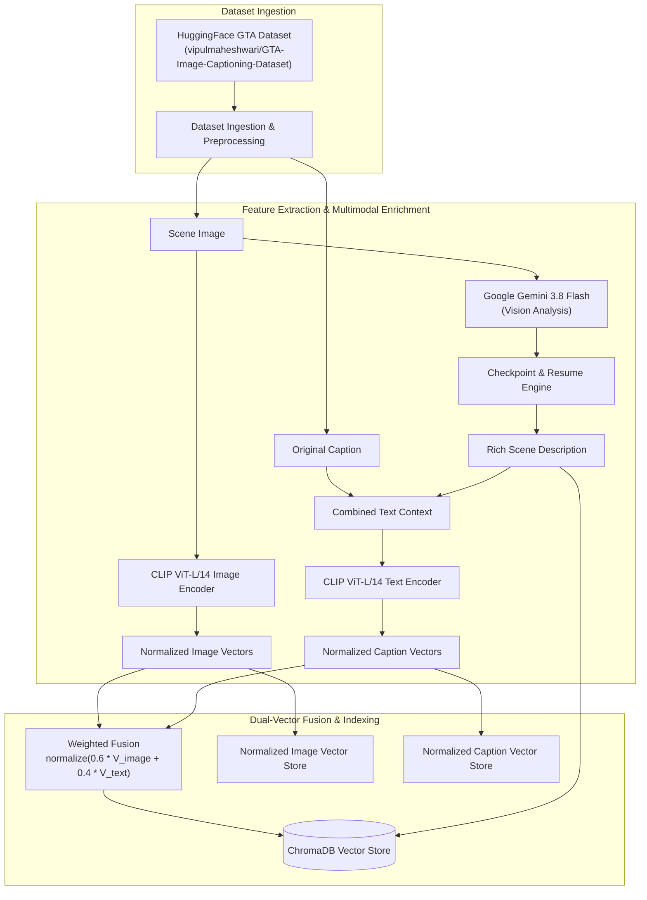

# 🎮 GTA Multimodal RAG Search

A production-ready multimodal Retrieval-Augmented Generation (RAG) system enabling natural language scene search across the Grand Theft Auto universe.

The system combines **SentenceTransformer CLIP ViT-L/14** visual and textual embeddings with **Google Gemini 3.8 Flash** multimodal scene reasoning and **Reciprocal Rank Fusion (RRF)** vector retrieval to deliver sub-200ms scene matching and deep visual question answering.

---

## 🏛️ System Architecture

The application operates in two distinct phases: an **offline indexing pipeline** that pre-computes multimodal representations, and an **online search application** that fuses cross-modal rankings in real time.

### 1. Offline Indexing Pipeline (`index_dataset.py`)



### 2. Online Search & Live Reasoning Flow (`app.py`)

```mermaid
flowchart LR
    subgraph USER_INPUT["User Interface"]
        QUERY["Natural Language Query<br/>'Sports car drifting at sunset'"]
    end

    subgraph VECTOR_RETRIEVAL["Dual-Stream RRF Vector Search"]
        CLIP_Q["CLIP Text Encoder"]
        QUERY --> CLIP_Q
        CLIP_Q --> V_Q["Query Vector"]

        CACHE_I[("Image Embeddings")]
        CACHE_C[("Caption Embeddings")]

        V_Q --> SIM_I["Cosine Sim (Visual Channel)"]
        CACHE_I --> SIM_I

        V_Q --> SIM_C["Cosine Sim (Semantic Channel)"]
        CACHE_C --> SIM_C

        SIM_I & SIM_C --> RRF["Reciprocal Rank Fusion (RRF)<br/>Score = 1/(60 + Rank_img) + 1/(60 + Rank_cap)"]
        RRF --> TOP["Top Candidate Scene Index"]
    end

    subgraph PRESENTATION["Result Synthesis & Multimodal Reasoning"]
        TOP --> FETCH_IMG["GTA Dataset (Image & Caption)"]
        TOP --> FETCH_DESC["ChromaDB (Pre-indexed Description & Provenance)"]
        FETCH_IMG & FETCH_DESC --> UI["Streamlit UI Display<br/>- Matched Image & Distance<br/>- Dataset Caption<br/>- Pre-indexed Gemini Description<br/>- Latency & Provenance Badge"]

        UI --> DEEP_DIVE["Interactive Scene Q&A (Optional)"]
        DEEP_DIVE --> LIVE_GEMINI["Live Gemini 3.8 Flash<br/>(Visual Reasoning)"]
        LIVE_GEMINI --> INSIGHTS["Live Scene Intelligence"]
    end
```



---

## 🧩 Key Components & Technology Stack

| Component | Technology | Role in Architecture |
|---|---|---|
| **Multimodal Embedding** | [CLIP ViT-L/14](https://huggingface.co/sentence-transformers/clip-ViT-L-14) | Maps both visual scenes and natural language text into a shared 768-dimensional space. |
| **Vector Storage** | [ChromaDB](https://www.trychroma.com/) (v0.5.5+) | Embedded vector database storing fused embeddings, scene descriptions, and provenance metadata. |
| **Vision LLM** | [Google Gemini 3.8 Flash](https://ai.google.dev/) | Generates granular offline scene annotations and provides live visual question-answering. |
| **Ranking Algorithm** | Reciprocal Rank Fusion (RRF) | Fuses visual-to-image and text-to-text rank distributions to prevent modality collapse. |
| **Web Interface** | [Streamlit](https://streamlit.io/) (v1.38.0+) | Responsive, wide-layout UI with search caching, latency metrics, and provenance badges. |
| **Dataset** | [GTA-Image-Captioning-Dataset](https://huggingface.co/datasets/vipulmaheshwari/GTA-Image-Captioning-Dataset) | High-fidelity GTA game screenshots paired with natural language descriptive captions. |

---

## 📁 Project Structure

```plaintext
GrandTheftAuto-multimodal-RAG-application/
├── app.py                     # Interactive Streamlit search & multimodal deep-dive application
├── index_dataset.py           # Offline indexing pipeline with checkpointing and dual-vector caching
├── requirements.txt           # Production Python package dependencies
├── .env.example               # Environment configuration template
├── .gitignore                 # Git ignore rules
└── utils/
    ├── __init__.py            # Package initialization
    └── utils.py               # Core utilities: RRF search, logging, ChromaDB, Gemini client
```

---

## 🚀 Getting Started

### 1. Prerequisites

- Python 3.10 or higher
- Git
- Google Gemini API Key ([Get one here](https://aistudio.google.com/app/apikey))

### 2. Installation

Clone the repository and install dependencies in a virtual environment:

```bash
# Clone the repository
git clone https://github.com/henryhyunwookim/GrandTheftAuto-multimodal-RAG-application.git
cd GrandTheftAuto-multimodal-RAG-application

# Create and activate virtual environment
python -m venv .venv
# On Windows (PowerShell):
.venv\Scripts\Activate.ps1
# On Linux/macOS:
source .venv/bin/activate

# Install dependencies
pip install -r requirements.txt
```

### 3. Environment Configuration

Copy `.env.example` to `.env` and provide your credentials:

```bash
cp .env.example .env     # On Linux/macOS
copy .env.example .env   # On Windows PowerShell / CMD
```

Edit `.env`:

```env
# Google Gemini API Key (Required for multimodal scene description and live analysis)
GOOGLE_API_KEY=your_gemini_api_key_here

# Default Gemini model for multimodal visual reasoning (Optional; defaults to gemini-3.8-flash)
GEMINI_MODEL=gemini-3.8-flash
```

| Variable | Required | Default | Description |
|---|---|---|---|
| `GOOGLE_API_KEY` | **Yes** (for LLM) | *None* | Gemini API Key from Google AI Studio. |
| `GEMINI_MODEL` | No | `gemini-3.8-flash` | Gemini model ID (`gemini-3.8-flash`, `gemini-2.0-flash`, `gemini-1.5-flash`). |

---

## ⚡ Indexing the Dataset

Before launching the web UI, build the search index using `index_dataset.py`. The pipeline supports checkpointing (resumes automatically if interrupted), batch inference, and model provenance tracking.

```bash
# Recommended: Full indexing with Gemini multimodal scene descriptions
python index_dataset.py

# Fast trial run on first 10 images (great for verifying setup)
python index_dataset.py --sample-size 10

# Offline/Free Mode: Index using dataset captions only (no API key required)
python index_dataset.py --skip-llm

# Force a complete rebuild from scratch
python index_dataset.py --force-reindex
```

### CLI Arguments Reference

| Flag | Type | Default | Description |
|---|---|---|---|
| `--sample-size` | `int` | `0` | Number of images to index (`0` processes all records). |
| `--skip-llm` | `flag` | `False` | Skips Gemini description generation; relies purely on captions. |
| `--force-reindex` | `flag` | `False` | Clears existing ChromaDB collection and rebuilds from scratch. |
| `--embedding-model` | `str` | `sentence-transformers/clip-ViT-L-14` | Hugging Face model identifier for vector generation. |
| `--llm-model` | `str` | `gemini-3.8-flash` | Gemini model identifier used for rich scene descriptions. |
| `--collection-name` | `str` | `gta_hybrid_v2` | Target ChromaDB collection name. |
| `--image-weight` | `float` | `0.6` | Weight allocated to visual vector in fused representation (`0.0` to `1.0`). |

---

## 🖥️ Running the Web Application

Launch the Streamlit web application with:

```bash
streamlit run app.py
```

Access the interface in your browser at `http://localhost:8501`.

### UI Highlights

1. **Instant Search**: Type queries like *"A helicopter hovering over the skyscrapers downtown"* and hit **Search Scene** for sub-200ms retrieval.
2. **Model Provenance Badge**: Displays live metadata:
   > 🏷️ **Index v2.0.0** · Embedding: `clip-ViT-L-14` · Descriptions: `gemini-3.8-flash` · Docs: 2500 · Created: 2026-09-14
3. **Side-by-Side Comparison**: Visually inspect the matched scene with its cosine similarity distance, original ground-truth caption, and pre-indexed Gemini scene narrative.
4. **Live Deep-Dive Scene Q&A**: Expand the **"🔬 Ask Gemini for a live deep-dive analysis"** widget to ask arbitrary questions about the retrieved scene (e.g., *"What is the weather condition?"*, *"List all license plates or vehicle colors visible"*).
5. **Reset & Clean Session**: One-click **Terminate / Reset** clears session state and memory instantly.

---

## 🏷️ Model Provenance & Index Versioning

Every indexed record stored in ChromaDB contains comprehensive model lineage metadata:

```json
{
  "image_id": 42,
  "original_caption": "A sports car speeding down a boulevard during a neon sunset...",
  "embedding_model": "sentence-transformers/clip-ViT-L-14",
  "llm_model": "gemini-3.8-flash",
  "index_version": "2.0.0",
  "indexed_at": "2026-09-14T22:30:15Z",
  "has_gemini_desc": true
}
```

When upgrading to newer foundation models (e.g., future Gemini releases or enhanced CLIP variants), re-index while preserving historical records:

```bash
python index_dataset.py --force-reindex --llm-model gemini-3.8-flash --collection-name gta_hybrid_v2
```

---

## 🔍 Observability & Logging

All indexing operations, user search queries, retrieval latencies, and LLM inference timings are structured through the centralized logging module (`utils/utils.py`):

```plaintext
[INFO] [app]: Initiating vector search for query: 'sports car at sunset' [Collection: gta_hybrid_v2]
[INFO] [app]: Query text encoded in 18.2ms
[INFO] [app]: Dual-stream RRF search completed in 4.1ms
[INFO] [app]: Search successfully returned match in 22.3ms for query: 'sports car at sunset'
```

---

## 🔬 Limitations & Future Roadmap

- **GPU Acceleration**: CLIP ViT-L-14 defaults to CPU when CUDA is unavailable. While online search takes < 50ms, initial bulk indexing benefits significantly from an NVIDIA GPU with PyTorch CUDA enabled.
- **Advanced Encoders**: Potential integration with newer open vision-language backbones such as SigLIP 2 or EVA-CLIP for enhanced cross-modal alignment.
- **Multimodal Feedback**: Allowing users to upload query images alongside text prompts for combined text + image reference search.

---

## 📚 References & Acknowledgments

- **Dataset**: [GTA-Image-Captioning-Dataset](https://huggingface.co/datasets/vipulmaheshwari/GTA-Image-Captioning-Dataset) by Vipul Maheshwari.
- **Visual Embeddings**: [SentenceTransformers CLIP ViT-L/14](https://huggingface.co/sentence-transformers/clip-ViT-L-14).
- **Vision LLM**: [Google Gemini Models](https://ai.google.dev/) via Google Generative AI Python SDK.
- **Vector Database**: [ChromaDB](https://github.com/chroma-core/chroma).